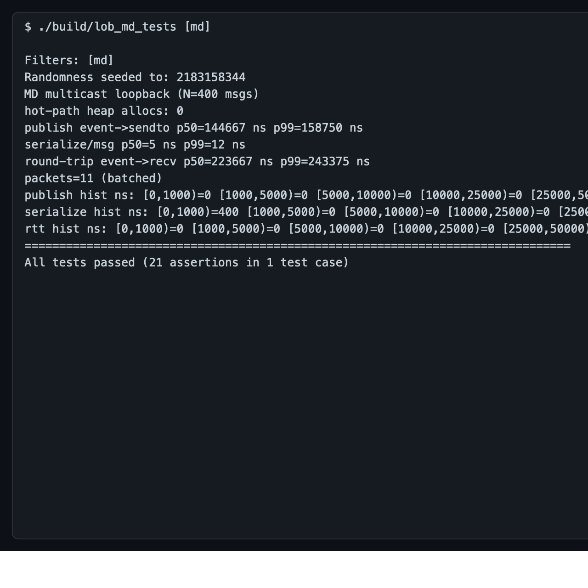
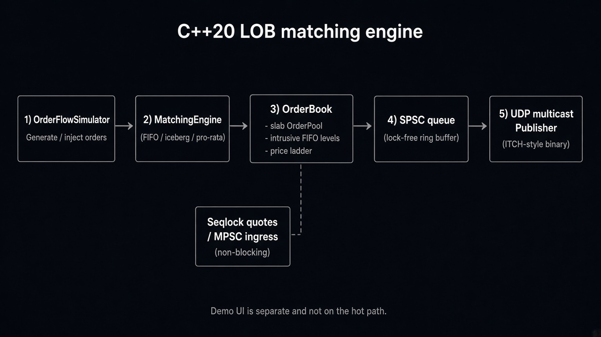
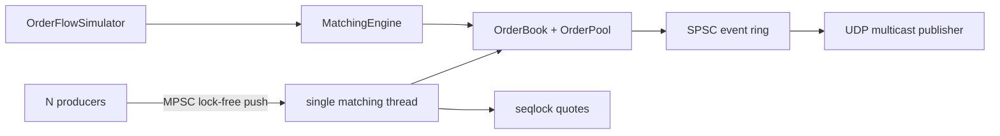

# C++20 limit-order book

Single-writer matching engine: price-time FIFO, iceberg replenishment, deterministic pro-rata, slab-allocated orders, lock-free MPSC *ingress*, ITCH-style UDP multicast *egress*.

This is a library plus tests and benches — not an exchange. The page in [`demo/`](demo/index.html) is a **Demo UI**, not production.

[](docs/assets/terminal.gif)

*Loopback MD test (400 msgs, 0 hot-path allocs) and a slice of `lob_bench` (pool, depth 10/100). Clock p50 ≈ 42 ns — pool add p50 sitting on that floor is not “the engine is 42 ns.”*

## Architecture





Matching mutates **one** book on **one** thread. Other threads enqueue commands or read seqlock quotes. Sharded mutex books exist only as a comparison (`bench/bench_contention.cpp`).

## Demo UI (HR / walkthrough)

Open in a browser (no build):

```bash
open demo/index.html
```

Yellow banner is intentional: in-browser matcher is a **JavaScript toy**. Ladder bars, last fills, and the ns readout are **UI-thread** `performance.now()`, not the C++ engine.

Drive the **real** `OrderBook` (same snapshot format the engine uses):

```bash
cmake --build build --target lob_demo
python3 demo/server.py          # http://127.0.0.1:8765
```

`demo/server.py` spawns `build/lob_demo --json` if present; otherwise it uses a Python toy book and says so on stderr.

Interactive CLI on the real book:

```bash
./build/lob_demo
# LIMIT BUY 10000 10
# MARKET SELL 3
# SNAP
```

## Build and tests

CMake ≥ 3.25, C++20. First configure fetches Catch2 (and Google Benchmark if enabled).

```bash
cmake -S . -B build -DCMAKE_BUILD_TYPE=Release -DLOB_ENABLE_BENCH=ON
cmake --build build -j
ctest --test-dir build --output-on-failure
```

| Target | Role |
|---|---|
| `lob_order_tests` | Pool: 1M alloc/free, **zero extra `new`**; book FIFO |
| `lob_matching_tests` | Iceberg loses time priority; pro-rata; stops |
| `lob_concurrent_tests` | MPSC / seqlock / pipeline |
| `lob_md_tests` | Packed ITCH UDP loopback + latency histogram |
| `lob_bench` | p50/p99/p99.9 vs depth, pool vs heap |
| `lob_contention_bench` | MPSC vs sharded mutex vs `N` (this laptop = 10 cores) |
| `lob_profile` | Full pipeline timers + locality microbenches |
| `lob_demo` | JSON/REPL snapshot process for the Demo UI |

Thread sanitizer (separate tree, do not mix with ASan):

```bash
cmake -S . -B build-tsan -DCMAKE_BUILD_TYPE=RelWithDebInfo -DLOB_ENABLE_TSAN=ON
cmake --build build-tsan -j
```

## Numbers (measured on Apple M4)

Details: [`docs/writeup.md`](docs/writeup.md), [`docs/profiling.md`](docs/profiling.md), [`docs/matching_semantics.md`](docs/matching_semantics.md).

- Pool vs heap `add_limit_order` ns/op ≈ **2.4×** (depth 10 and 10k).
- Simulator into book (pool): **5.6M → 2.9M events/s** as depth 10 → 10k.
- After replacing `unordered_map` ids with a dense vector: mixed pipeline **+21% events/s** (3.81M → 4.62M).
- UDP serialize **~6 ns/msg**; event→`sendto` p50 **~100 µs** is **batching wait**, not serdes.
- `hardware_concurrency() = 10`. Contention ingest vs N is **not** a scaling study.

`valgrind`/`perf` were **not** available on this Mac. Tail attribution used `/usr/bin/sample` plus histograms, not fabricated L1 miss rates.

## Layout

```
include/lob/   book, pool, queues, seqlock, pipeline
src/           implementations
net/           ITCH framing, multicast publisher/receiver
bench/         Google Benchmark + pipeline profiler
tests/         Catch2
demo/          Demo UI + lob_demo + optional HTTP shim
docs/          writeup, profiling, matching rules, assets
```
